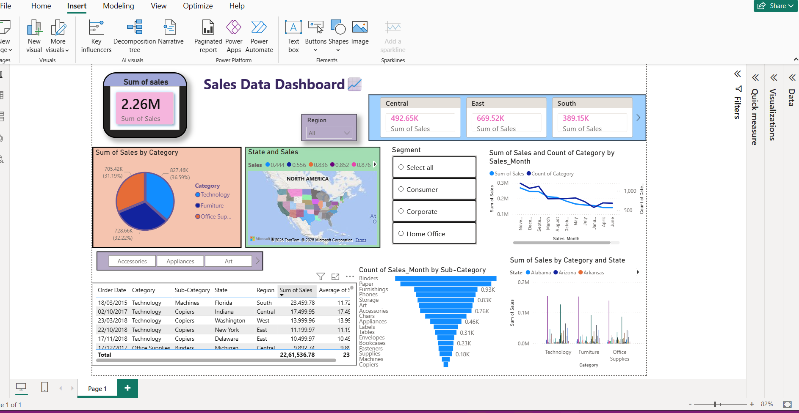

# Sales Performance Dashboard

## Overview
This is my first Power BI dashboard project.

## Tools Used
- Power BI
- Power Query

## Features
- Total Sales KPI
- Region-wise Sales Analysis
- Category-wise Analysis
- State-wise Sales Map
- Monthly Sales Trend
- Interactive Slicers

## Key Insights
- West region generated the highest sales.
- Technology category contributed the most sales.
- Binders was the top-performing sub-category.

## Dashboard Preview

